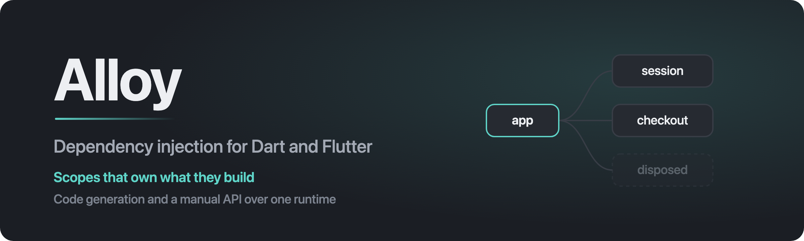

<p align="center">
  
</p>

<p align="center">
  <a href="https://pub.dev/packages/alloy"></a>
  <a href="https://pub.dev/packages/alloy/score"></a>
  <a href="https://pub.dev/packages/alloy"></a>
  <a href="https://github.com/rutikeyone/alloy/actions/workflows/ci.yml"></a>
  <a href="LICENSE"></a>
</p>

<p align="center">
  <p align="center">
  <a href="README.md">English</a> · <a href="README.ru.md">Русский</a> · <a href="README.zh-CN.md">中文</a>
</p>
</p>

# Alloy

Dependency injection framework for Dart and Flutter. Dual-mode: declarative code generation and a
pure-Dart manual API over the same runtime.

Status: **Phase 1 complete.** Runtime, Flutter bindings, annotations, analysis layer, both
generators and the lint plugin are implemented and tested.

| | |
|---|---|
| **Using it without code generation** | [GUIDE_MANUAL.md](GUIDE_MANUAL.md) — you write the registrations |
| **Using it with the generator** | [GUIDE_CODEGEN.md](GUIDE_CODEGEN.md) — annotations, and the graph checked at build time |
| **Coming from `get_it` or `injectable`** | [MIGRATION.md](MIGRATION.md) — what maps, and what does not |
| **See it running** | `cd examples/gallery && flutter run` |

## What it is

A container that owns what it builds. Scopes form a tree rather than a stack, so a session, a
checkout flow and a screen each get a lifetime of their own, and ending one takes everything built
inside it with it — logout is `await scope.dispose()`, not nine subscriptions to a session stream
and four `reset()` methods that leaked into domain interfaces.

Code generation is a convenience over that runtime, never a second framework. The generator emits
exactly what you would write by hand, using nothing but the public API of `alloy`, which is what
makes gradual migration possible: a generated container and a hand-written one compose in the same
graph.

## Features

| | |
|---|---|
| **Hierarchical scopes** | a tree, not a flat stack — two independent subtrees can coexist, which a stack cannot express |
| **Ownership and teardown** | the scope releases what it built, LIFO by **creation** order, best-effort with one deadline for the whole tree |
| **Two-phase startup** | `@AlloyBootstrap` before the container exists, `@AlloyInit` inside it, both awaited before `start` returns |
| **Topological ordering** | async initializers are layered by Kahn's algorithm; independent branches run through `Future.wait`, a cycle fails the build naming the cycle |
| **Property injection** | `late final` fields filled by a generated mixin, so a class with five collaborators has an empty constructor |
| **Compile-time completeness** | a dependency nothing registers fails the build, naming every gap at once |
| **Parameterized registrations** | `@AlloyParam` for what the call site supplies; the generator writes the argument type as a named record |
| **Optional dependencies** | `Foo?` resolves through `getOrNull` and injects null instead of failing the build |
| **Modules** | register types you did not write — a client from another package, a value the SDK hands you |
| **Environments** | one abstraction, a different implementation per build, with overlaps rejected at build time |
| **Named and multi-injection** | `@Named` qualifiers and `getAll<T>()` over every registration of a type |
| **Observability** | typed events, not strings — logging, structured intake and crash reports with a trail |
| **In-app inspector** | the live scope tree, what was built and with what lifetime, and everything reported |
| **Navigation flows** | a scope whose lifetime is a go_router flow, without anything mirroring the router |
| **Lint plugin** | twelve rules on the same parsing layer the generator uses |
| **Test helpers** | scopes that dispose with the test, overrides that work the way production ones do |
| **No global container** | nothing is ambient, so tests run in parallel and two graphs in one process are unrelated |

## Packages

| Package | Depends on | Ships to apps |
|---|---|---|
| `alloy_annotations` | `meta` | yes |
| `alloy` | `alloy_annotations` | yes, runtime core, no Flutter |
| `alloy_flutter` | `alloy`, `flutter` | yes |
| `alloy_go_router` | `alloy_flutter`, `go_router` | yes, optional |
| `alloy_bloc` | `alloy`, `bloc` | yes, optional |
| `alloy_talker` | `alloy`, `talker` | yes, optional |
| `alloy_logging` | `alloy`, `logging` | yes, optional |
| `alloy_logger` | `alloy`, `logger` | yes, optional |
| `alloy_analyzer` | `alloy_annotations`, `analyzer` | no |
| `alloy_generator` | `alloy_analyzer`, `build`, `source_gen`, `code_builder` | dev_dependency only |
| `alloy_lint` | `alloy_analyzer`, `analysis_server_plugin` | dev_dependency only |
| `alloy_test` | `alloy`, `test_api`, `matcher` | dev_dependency only |
| `alloy_test_flutter` | `alloy_flutter`, `flutter_test` | dev_dependency only |
| `alloy_inspector` | `alloy_flutter`, `flutter` | dev_dependency only |
| `alloy_talker_flutter` | `alloy_inspector`, `alloy_talker`, `talker_flutter` | dev_dependency only |

`alloy_analyzer` exists so the generator and the lint plugin parse Alloy declarations through one
implementation instead of two that drift apart. It owns the IR and the topological sort, and depends
on neither `build` nor the plugin API.

**Project invariant:** generated code may only use the public API of `alloy`. The moment generation
needs something Manual Mode cannot express, these are two frameworks sharing a name.

## Requirements

Built and tested on **Flutter 3.47.1 / Dart 3.13.1**, with analyzer 13.3.0.

Every package requires Dart `^3.13.0`, and no Flutter below **3.47** ships it — so that is the floor,
uniformly, and there is no version spread between packages to watch out for. CI runs `stable` and
`beta` rather than a matrix of past releases: the useful failure to catch is the one that has not
shipped yet.

Do not use a Homebrew `dart` on PATH — put the Flutter SDK first. An older `dart` does not fail
loudly: `dart analyze .` reports dozens of phantom issues against the wrong analyzer, and `dart pub
get` refuses the SDK constraint outright. Check with `dart --version` before trusting a run.

## How it works

### Scopes own what they build

A scope is a node with a parent, children and its own registrations. Resolution walks up, so a
registration in a child shadows one above it — which is how an override works in a test and how a
session's repository replaces the anonymous one in production, through the same mechanism rather
than a back door.

Teardown is LIFO by **creation** order, not declaration order. That distinction is the bug in most
hand-written containers: a component declared first but created last is destroyed first, while
something still depends on it. And it is best-effort — a `dispose` that throws is recorded and the
rest still run, the whole tree shares one deadline, and what did not finish is listed in
`AlloyDisposeError` rather than the first failure hiding the other nine.

Parents hold children strongly. Weak references were considered and rejected: they would allow a
child scope to be collected before `dispose()` ran, which means never running it, and they do not
prevent leaks anyway because live objects inside hold themselves.

### The graph is checked before it builds

Code-Gen Mode rejects an incomplete graph at build time, naming every gap in one message:

```
Diagnostics requires DeviceInfo, which nothing registers. Annotate the class that
provides it with @AlloyInject, or name it in @AlloyScopeRoot(provides: [...]) when
something outside the generated container registers it.
```

Constructor parameters, `@injected` fields and `@AlloyInit(dependsOn:)` all count, a `@Named`
qualifier is part of the key, and each environment is checked separately. Duplicate registrations,
dependency cycles, two scope roots in one package, a generic injectable class and an abstract one are
all build failures too.

This is a Code-Gen guarantee, and the boundary is honest: a hand-written factory resolves inside
`create`, so nothing static can see what it will ask for. Manual Mode graphs still fail at runtime —
`alloy_test` carries `expectGraphResolves` for exactly that gap.

### Generated code is what you would have written

Three builders: one writes property-injection mixins, one scans each library into IR, one aggregates
the whole package into `lib/alloy.g.dart`. The aggregation is two-phase because a single build step
cannot see the whole program.

The output is private const factory classes and a `$AlloyRootScope`, ordered by a compile-time
topological sort — no closures, no reflection, no runtime scanning. `$alloyBootstrap` is a getter
rather than a stored list, so a restart gets fresh steps instead of the ones the previous start
already consumed.

Generic types work as dependencies and as `exposeAs` targets — `Repository<User>` and
`Repository<Order>` are two registrations, because `AlloyKey` is built from `Type` and those are
different types. The injectable class itself may not be generic: nothing tells the generator which
instantiations to register.

### Observability is typed events

`AlloyObserver` reports what the graph does — scopes appearing, instances being built, startup
finishing, teardown failing. Callbacks receive descriptions rather than live objects, because an
observer that could resolve from a scope halfway through teardown is not watching any more, and an
exception from a callback is swallowed: watching must not break what it watches.

Records carry `kind` as a value, not a sentence, which is what lets a structured intake key on
`AlloyEventKind.scopeInitFailed` without parsing prose. Log sinks are one callback, so no logger is
locked out for want of an adapter package; crash reporting has a shape of its own, because what makes
a report actionable is the trail of what the graph was doing beforehand.

With no observers registered, the cost of every event is one empty-list check.

### Navigation flows

`alloy_go_router` makes a scope's lifetime a navigation flow: created when the flow opens, disposed
when it closes. It is an ordinary `ShellRoute` subclass, and the scope is owned by a widget inside
it — nothing watches the router and mirrors it, because mirroring is where hand-rolled versions break
on the back button, on deep links and on tab switches.

A flow whose routes are not one subtree cannot be expressed this way, and that limitation is
deliberate; see the package README.

## Lint rules

`alloy_lint` is an `analysis_server_plugin`, not a `custom_lint` plugin. It ships twelve warning
rules, all built on the same `alloy_analyzer` parsing layer the generator uses, so a mistake surfaces
in the IDE instead of only when `build_runner` runs:

| Rule | Catches |
|---|---|
| `alloy_missing_injection_mixin` | `@injected` fields without `with _$ClassName`, on a class the container registers |
| `alloy_injected_field_needs_an_injectable` | `@injected` fields on a class the container never registers |
| `alloy_param_needs_an_injectable` | `@AlloyParam` on a class the container never registers |
| `alloy_injected_field_must_be_late_final` | `@injected` on a mutable, non-late, or static field |
| `alloy_injectable_must_be_constructible` | `@AlloyInject` on an abstract class or one with no public generative constructor |
| `alloy_init_requires_init_method` | `@AlloyInit` on a class with no `init()` |
| `alloy_bootstrap_requires_run_method` | `@AlloyBootstrap` on a class with no `run()` |
| `alloy_bootstrap_step_cannot_inject` | a bootstrap step whose constructor takes required parameters |
| `alloy_environment_needs_a_registration` | `@AlloyEnvironment` on a class nothing registers, where it silently does nothing |
| `alloy_dependency_is_not_registered` | an injected dependency nothing in the package registers |
| `alloy_dependency_cycle` | an injectable class that depends, eventually, on itself |
| `alloy_registration_is_never_released` | a registered class with a `dispose()` or `close()` the scope cannot see |

`custom_lint` is not used: its latest release (0.8.1) is pinned to `analyzer ^8.0.0` and cannot
coexist with a modern analyzer. `riverpod_lint` migrated off it to the first-party
`analysis_server_plugin`, and `alloy_lint` follows.

Setting the plugin up has two traps worth reading about before you hit them — see
[GUIDE_CODEGEN.md §16](GUIDE_CODEGEN.md#16-the-lint-plugin).

## Examples

One app runs them all:

```bash
cd examples/gallery && flutter run
```

The gallery is organised by **capability**, not by project — a reader arrives wanting to know how
scopes end, not wanting to see `notes_app`. Fourteen entries in six sections:

| Section | Entries |
|---|---|
| Startup | Two-phase startup · Environments |
| Injection | Property injection · Named and multi-injection |
| Scopes & lifetime | Widget-owned scope · Session scope · Scope tree · Navigation flows · Teardown |
| Code generation | Generated container · Manual mode |
| Observability | Graph events · In-app inspector |
| Testing | Testing patterns |

Each entry that has a UI opens with a graph **of its own**, built when you open it and disposed when
you leave. Open two and their scope trees are unrelated — which is the thing the gallery is really
there to show. The three entries with no UI (`Teardown`, `Manual mode`, `Testing patterns`) show
their console output instead of a button, because a gallery that offered to "open" a CLI would be
lying.

The gallery is written in English, Russian and Chinese, switchable from the hub — and so is every
screen it mounts. Each example package carries its own `l10n/*.arb` and generates its own delegate,
which the gallery collects beside its own and the inspector's; that is what a multi-package Flutter
app looks like.

The framework's own log records are still English, as are the identifiers on screen — step names,
scope names, registration keys, lifetimes. See the
[`alloy_inspector` README](packages/alloy_inspector/README.md) for what stays in Alloy's own words
and why, and the [gallery's](examples/gallery/README.md) for how the examples are wired.

## Working on this repository

```
dart analyze --fatal-infos .
dart format --output=none --set-exit-if-changed .
(cd packages/alloy && dart test)
(cd packages/alloy_flutter && flutter test)
(cd examples/manual_mode && dart test)
(cd examples/codegen_basics && dart run build_runner build && flutter test)
(cd examples/notes_app && dart run build_runner build && flutter test)
(cd packages/alloy_lint && dart test)
(cd packages/alloy_test && dart test)
(cd packages/alloy_inspector && flutter test)
(cd packages/alloy_talker_flutter && flutter test)
(cd examples/gallery && flutter test)
(cd compat/external_consumer && dart pub get && dart run build_runner build && dart test)
./tool/coverage.sh
```

`tool/coverage.sh` measures line coverage of the publishable packages that have tests, prints them
worst-first, and fails under a floor on the **total** — 85%. The current figure is what the script
prints and is not repeated here: a number that moves with every commit goes stale in prose and
nothing checks it, which it has already done twice. The floor is on the total rather than per package
deliberately: coverage is measured per package while the code is shared, so `alloy_analyzer`'s
parsers are driven far more from `alloy_generator`'s tests and from `compat/external_consumer` than
from their own suite. A per-package floor would demand tests written where they do not belong.
Override it with `COVERAGE_FLOOR=90 ./tool/coverage.sh`.

CI (`.github/workflows/ci.yml`) runs all of the above on `stable` and `beta`, plus a `git diff
--exit-code` after regenerating both examples **and `compat/external_consumer`**, so stale generated
code fails the build. The generator formats its own output with the same `dart_style` version the
format check uses, so the two never disagree.

**Layout.** One public type per file. The sealed `AlloyRegistration` hierarchy is the deliberate
exception: a sealed hierarchy must live in one library, so its subclasses are `part` files rather
than separate libraries. `compat/external_consumer` is outside that rule of thumb entirely — it is a
package that is deliberately **not** a workspace member and carries no `resolution: workspace`, so
pub resolves it standalone the way a third-party project would. It exists to keep the code-generation
pipeline honest from outside the repository.

**Known publish warning.** `alloy_lint` reports "the name of lib/main.dart should match the name of
the package". That entry point is fixed by the analysis server plugin API — the server generates code
that imports `package:alloy_lint/main.dart` and reads its `plugin` variable. `riverpod_lint` carries
the same warning.

## Licence

MIT. See [LICENSE](LICENSE).
